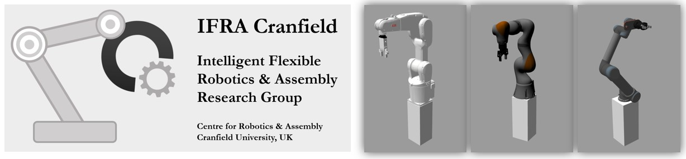

<!-- 

# ===================================== COPYRIGHT ===================================== #
#                                                                                       #
#  IFRA (Intelligent Flexible Robotics and Assembly) Group, CRANFIELD UNIVERSITY        #
#  Created on behalf of the IFRA Group at Cranfield University, United Kingdom          #
#  E-mail: IFRA@cranfield.ac.uk                                                         #
#                                                                                       #
#  Licensed under the Apache-2.0 License.                                               #
#  You may not use this file except in compliance with the License.                     #
#  You may obtain a copy of the License at: http://www.apache.org/licenses/LICENSE-2.0  #
#                                                                                       #
#  Unless required by applicable law or agreed to in writing, software distributed      #
#  under the License is distributed on an "as-is" basis, without warranties or          #
#  conditions of any kind, either express or implied. See the License for the specific  #
#  language governing permissions and limitations under the License.                    #
#                                                                                       #
#  IFRA Group - Cranfield University                                                    #
#  AUTHORS: Mikel Bueno Viso - Mikel.Bueno-Viso@cranfield.ac.uk                         #
#           Dr. Seemal Asif      - s.asif@cranfield.ac.uk                               #
#           Prof. Phil Webb        - p.f.webb@cranfield.ac.uk                           #
#                                                                                       #
#  Date: April, 2023.                                                                   #
#                                                                                       #
# ===================================== COPYRIGHT ===================================== #

# ======= CITE OUR WORK ======= #
# You can cite our work with the following statement:
# IFRA (2023) ROS 2: Sim-to-Real Robot Control. URL: https://github.com/IFRA-Cranfield/ros2_SimRealRobotControl.

-->

<!--

  README.md TEMPLATE obtined from:
      https://github.com/othneildrew/Best-README-Template
      AUTHOR: OTHNEIL DREW 

-->

<!-- HEADER -->
 

  

   

  <h2 align="center">ROS 2: Sim-to-Real Robot Control</h2>

  

    IFRA (Intelligent Flexible Robotics and Assembly) Group
     
    Centre for Robotics and Assembly
     
    Cranfield University
  

<!-- TABLE OF CONTENTS -->

  
Table of Contents

  <ol>
    <li>
      <a href="#about">About</a>
      <ul>
        <li><a href="#intelligent-flexible-robotics-and-assembly-group">IFRA Group</a></li>
        <li><a href="#ros2_simrealrobotcontrol-repository">ros2_SimRealRobotControl Repository</a></li>
      </ul>
    </li>
    <li>
      <a href="#installation-and-usage">Installation and Usage</a>
      <ul>
        <li><a href="#installation">Installation</a></li>
        <li><a href="#usage">Usage</a></li>
      </ul>
    </li>
    <li><a href="#supported-robots">Supported Robots</a></li>
    <li>
      <a href="#ros2-packages">ROS2 Packages</a>
      <ul>
        <li><a href="#ros2srrc_data">ros2srrc_data</a></li>
        <li><a href="#ros2srrc_execution">ros2srrc_execution</a></li>
      </ul>
    </li>
    <li><a href="#contributing">Contributing</a></li>
    <li><a href="#license">License</a></li>
    <li><a href="#cite-our-work">Cite our work</a></li>
    <li><a href="#contact">Contact</a></li>
    <li><a href="#acknowledgments">Acknowledgments</a></li>
  </ol>

 

<!-- ABOUT THE PROJECT -->
## About

### Intelligent Flexible Robotics and Assembly Group

The IFRA (Intelligent Flexible Robotics and Assembly) Group is part of the Centre for Robotics and Assembly at Cranfield University.

IFRA Group pushes technical boundaries. At IFRA we provide high tech automation & assembly solutions, and we support smart manufacturing with Smart Industry technologies and solutions. Flexible Manufacturing Systems (FMS) are a clear example. They can improve overall operations and throughput quality by adapting to real-time changes and situations, supporting and pushing the transition towards flexible, intelligent and responsive automation, which we continuously seek and support.

The IFRA Group undertakes innovative research to design, create and improve Intelligent, Responsive and Flexible automation & assembly solutions, and this series of GitHub repositories provide background information and resources of how these developments are supported.

### ros2_SimRealRobotControl Repository

The ros2_SimRealRobotControl repository is a collection of ROS 2 packages that are designed to facilitate robot manipulation tasks. The packages include Gazebo Simulation, MoveIt!2, and Robot Bringup, all of which can be used to simulate and control robot manipulators.

The Gazebo Simulation package provides a simulation environment for robot manipulators, allowing users to test and develop control algorithms in a virtual environment before deploying them on a physical robot. MoveIt!2 is a motion planning framework that allows users to plan and execute robot manipulator trajectories, while the Robot Bringup package provides the interface for controlling the physical robot.

By combining these packages, the repository offers a comprehensive solution for developing and testing robot manipulator applications using ROS2. This can be particularly useful for researchers and engineers who are working on robotics projects, as it can significantly reduce the time and resources required for development and testing.

__Improvements: ros2_RobotSimulation -> ros2_SimRealRobotControl:__

On October 2022, IFRA-Cranfield released [ros2_RobotSimulation](https://github.com/IFRA-Cranfield/ros2_RobotSimulation), a GitHub repository containing "ready-to-use" ROS2 Industrial Robot Simulation packages, that consist of Gazebo (simulation) + MoveIt!2 (control) package combinations for some supported Industrial/Collaborative Robots (or Robot + Gripper combinations), and follows a common standard for a better understanding and further development.

This ros2_SimRealRobotControl repository is based on ros2_RobotSimulation, and contains some improvements and advanced features:
- Robot Bringup packages, that enable the control of REAL ROBOTS through ROS 2.
- The Pilz Industrial Motion Planner, which replaces the OMPL planner (MoveIt!2 default) used in ros2_RobotSimulation and allows for advanced motion control and features, such as cartesian speed control.
- In ros2_RobotSimulation, Robot Movements are triggered as individual ROS 2 Actions, each of them contained in a ROS 2 node. When executing Robot Programs (sequences) using ros2_execution, Robot Movements (execution steps) are executed by calling ROS 2 actions one by one. This introduces a small delay between steps. For ros2_SimRealRobotControl, all Robot Movements are contained in a single ROS 2 Action (therefore, a single ROS 2 node), and sequences are executed by calling a single ROS 2 Action from a python script. Thus, the delay introduced by ROS 2 Action calls is avoided, and the delay between movements now only depends on MoveIt!2's processing (plan+execute) time. Quicker and smoother results are obtained, closing the performance gap between ROS2-controlled robots and Industrial Manipulators.

In a nutshell, ros2_RobotSimulation is a great tool if you are new to ROS 2 and you wish to use it for Robot Simulation and Control, and ros2_SimRealRobotControl is appropriate for anyone willing to design, develop and test their own Robot applications using the ROS 2 packages (Gazebo+MoveIt!2+Bringup) provided.

(<a href="#top">back to top</a>)

<!-- INSTALLATION and USAGE -->
## Installation and Usage

All packages in this repository have been developed, executed and tested in an Ubuntu 22.04 machine with ROS 2 Humble. Please find below all the required steps to set-up a ROS 2 Humble environment in Ubuntu and install the ROS 2-based Robot Simulation and Control packages.

### Installation
TBD.

### Usage
TBD.

(<a href="#top">back to top</a>)

<!-- USAGE EXAMPLES -->
## Supported Robots

The Simulation & Control packages of the following Robots are currently available:
- [ABB IRB-120 Robot](https://github.com/IFRA-Cranfield/ros2_SimRealRobotControl/tree/humble/irb120)

(<a href="#top">back to top</a>)

<!-- ROS 2 Packages: Explanation -->
## ROS2 Packages 

### ros2srrc_data
TBD.

### ros2srrc_execution
TBD.

### Robot Simulation and Control packages
For the ROS 2-based Robot Simulation and Control to be successfully achieved, 3 different ROS 2 packages are necessary (for each Robot/Application):
- __Gazebo package__: The Gazebo/Simulation package contains all the information related to the Gazebo Simulation of the Robot Cell/Environment. CAD and mesh files containing visual data and [.urdf]+[.xacro] files containing Robot (ROS-format) data are combined with ROS 2 control and simulation components, and a simple simulation of the Robot (without any motion control) is obtained in Gazebo.  
- __MoveIt!2 package__: For the Robot to be moved and controlled, a ROS 2 MoveIt!2 package is required. This package contains all the information related to the ROS 2 - MoveGroup (moveit2) node that controls the robot and its movements.  
- __Bringup package__: The Bringup package acts as the main connection point between ROS 2 and the Real Robot. It contains all the information about the robot controllers, and establishes the connection between moveit2 and the Real Robot. It requires

(<a href="#top">back to top</a>)

<!-- CONTRIBUTING -->
## Contributing

This repo contains only a few number of robots, end-effectors and simulation environments (layouts). Please do let us know if you wish to include a specific robot/end-effector or application into ros2_SimRealRobotControl!

The exact same thing for the ROS2 Robot Actions/Triggers: A few number of robot movements have been implemented, therefore please do let us know if you have any ideas of a potential Robot motions for our repo!

Contributions are what make the open source community such an amazing place to learn, inspire, and create. Any contributions you make are **greatly appreciated**. If you have a suggestion that would make this better, or you find a solution to any of the issues/improvements presented above, please fork the repo and create a pull request. You can also simply open an issue with the tag "enhancement".
Don't forget to give the project a star! Thanks you very much!

(<a href="#top">back to top</a>)

<!-- LICENSE -->
## License

  Intelligent Flexible Robotics and Assembly Group
   
  Created on behalf of the IFRA Group at Cranfield University, United Kingdom
   
  E-mail: IFRA@cranfield.ac.uk 
   
   
  Licensed under the Apache-2.0 License.
   
  You may obtain a copy of the License at: http://www.apache.org/licenses/LICENSE-2.0
   
   
  <a href="https://www.cranfield.ac.uk/">Cranfield University</a>
   
  School of Aerospace, Transport and Manufacturing (SATM)
   
    <a href="https://www.cranfield.ac.uk/centres/centre-for-robotics-and-assembly">Centre for Robotics and Assembly</a>
   
  College Road, Cranfield
   
  MK43 0AL, Bedfordshire, UK
   

(<a href="#top">back to top</a>)

<!-- CITE OUR WORK -->
## Cite our work

  You can cite our work with the following statement:
   
  IFRA-Cranfield (2023) ROS 2 Sim-to-Real Robot Control. URL: https://github.com/IFRA-Cranfield/ros2_SimRealRobotControl.

(<a href="#top">back to top</a>)

<!-- CONTACT -->
## Contact

  Mikel Bueno Viso - Research Assistant in Intelligent Automation at Cranfield University
   
  E-mail: Mikel.Bueno-Viso@cranfield.ac.uk
   
  LinkedIn: https://www.linkedin.com/in/mikel-bueno-viso/
   
  Profile: https://www.cranfield.ac.uk/people/mikel-bueno-viso-32884399
   
   
  Dr. Seemal Asif - Lecturer in Artificial Intelligence and Robotics at Cranfield University
   
  E-mail: s.asif@cranfield.ac.uk
   
  LinkedIn: https://www.linkedin.com/in/dr-seemal-asif-ceng-fhea-miet-9370515a/
   
  Profile: https://www.cranfield.ac.uk/people/dr-seemal-asif-695915
   
   
  Professor Phil Webb - Professor of Aero-Structure Design and Assembly at Cranfield University
   
  E-mail: p.f.webb@cranfield.ac.uk
   
  LinkedIn: https://www.linkedin.com/in/phil-webb-64283223/
   
  Profile: https://www.cranfield.ac.uk/people/professor-phil-webb-746415 
   

(<a href="#top">back to top</a>)

<!-- ACKNOWLEDGMENTS -->
## Acknowledgments

* [README.md template - Othneil Drew](https://github.com/othneildrew/Best-README-Template).
* [ROS 2 Documentation - Humble](https://docs.ros.org/en/humble/index.html).
* [PicNik Robotics - MoveIt!2 Documentation](https://moveit.picknik.ai/humble/index.html).
* [ABB - ROS Repositories](http://wiki.ros.org/abb).
* [ABB - ROS 2 Driver (PickNik Robotics)](https://github.com/PickNikRobotics/abb_ros2).

(<a href="#top">back to top</a>)

